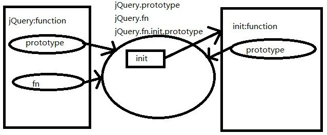

# jQuery-Analysis
try to read the source code and analyse it

## jQuery的无new构建

~~~
// Define a local copy of jQuery
jQuery = function( selector, context ) {
	// The jQuery object is actually just the init constructor 'enhanced'
	// 通过实例init函数，每次都构建新的init实例对象，来分隔this
	return new jQuery.fn.init( selector, context, rootjQuery );
},
~~~

~~~
// Give the init function the jQuery prototype for later instantiation
// 通过原型传递解决问题，把jQuery的原型传递给jQuery.prototype.init.prototype
// jQuery的原型对象覆盖了init构造器的原型对象
// 做到既能隔离作用域还能使用jQuery原型对象的作用域，还能在返回实例中访问jQuery的原型对象
jQuery.fn.init.prototype = jQuery.fn;
~~~

## 链式调用

通过简单扩展原型方法并通过return this的形式来实现跨浏览器的链式调用。

利用JS下的简单工厂模式，来将所有对于同一个DOM对象的操作指定同一个实例。

## 插件接口

~~~
// jQuery.extend和jQuery.fn.extend其实是同指向同一方法的不同引用
// jQuery.extend 对jQuery本身的属性和方法进行了扩展
// jQuery.fn.extend 对jQuery.fn的属性和方法进行了扩展
jQuery.extend = jQuery.fn.extend = function() {}
~~~

### this大显神威

> jQuery.extend 调用的时候，this是指向jQuery对象的(jQuery是函数，也是对象！)
> 所以这里扩展在jQuery上
> 而jQuery.fn.extend 调用的时候，this指向fn对象，jQuery.fn 和jQuery. 
> prototype指向同一对象，扩展fn就是扩展jQuery.prototype原型对象

